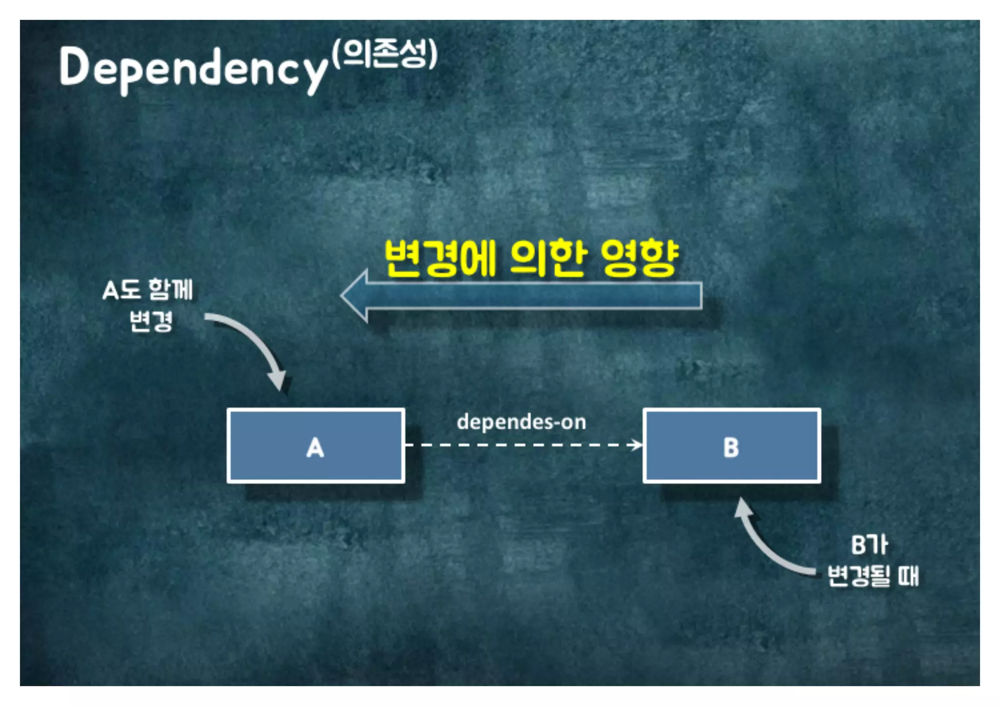
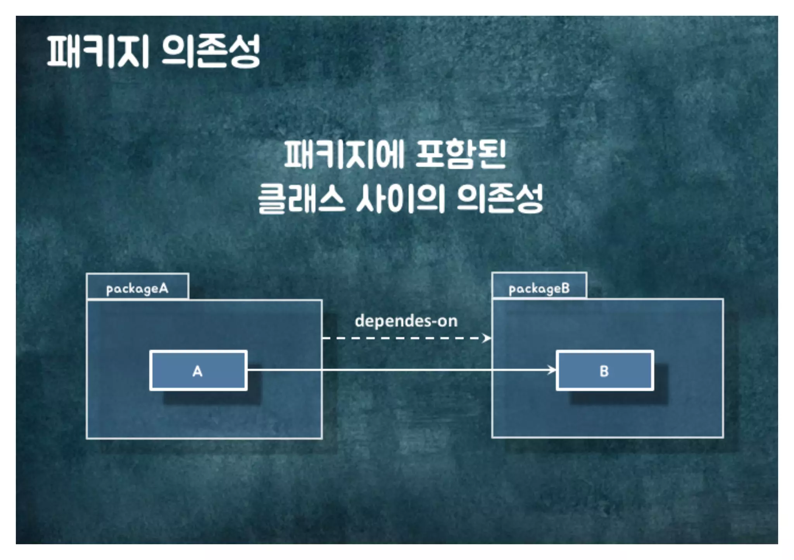
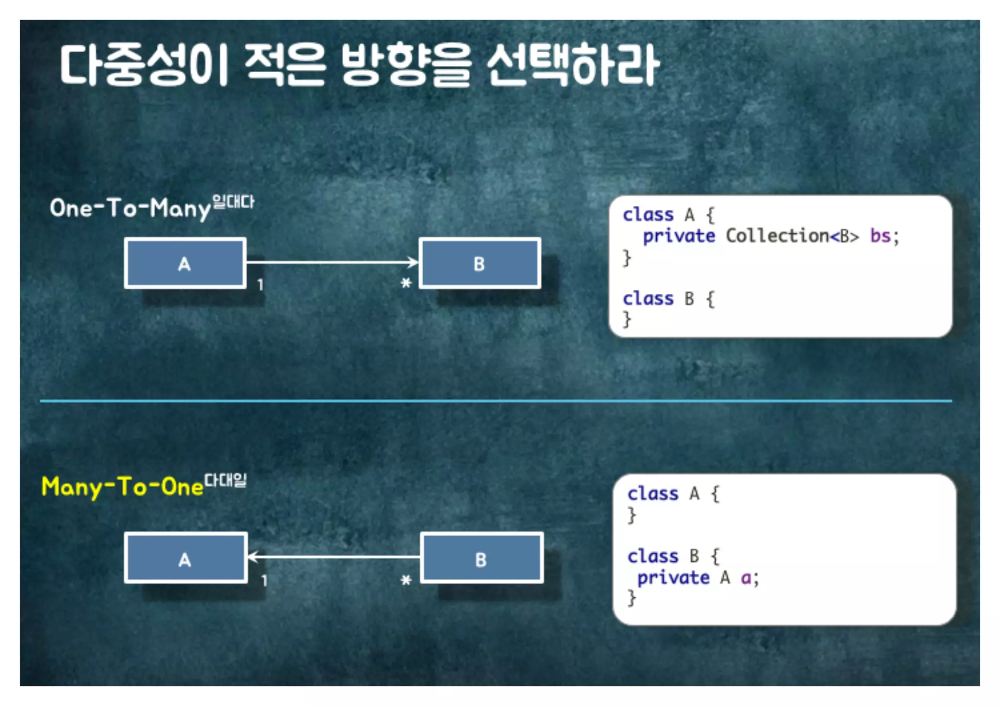
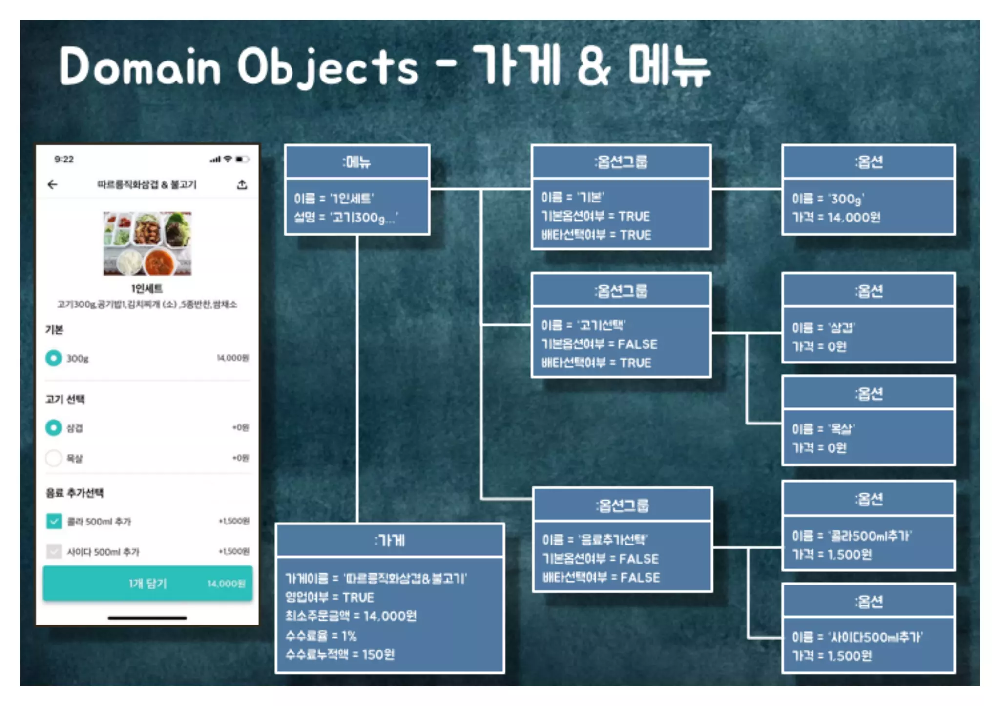
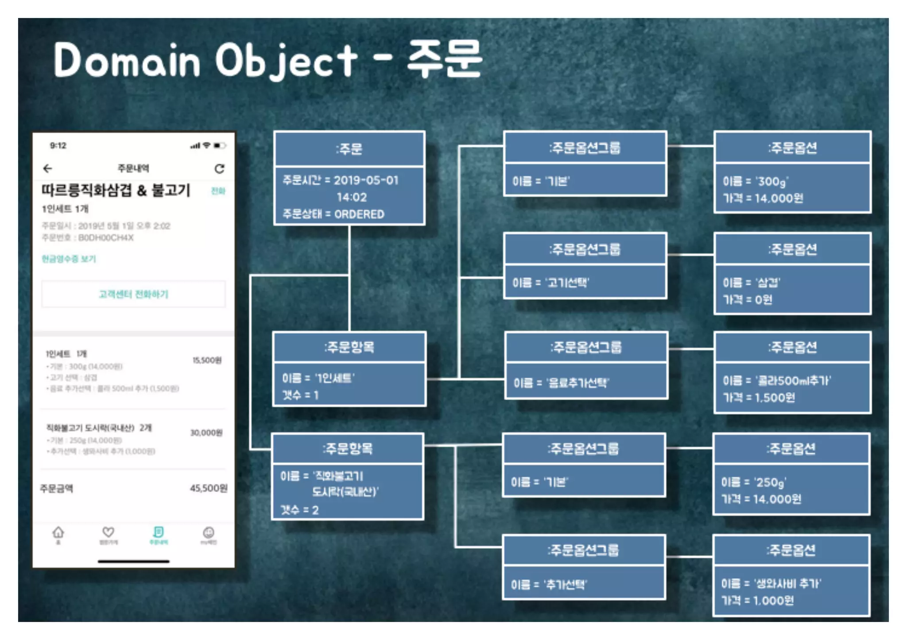
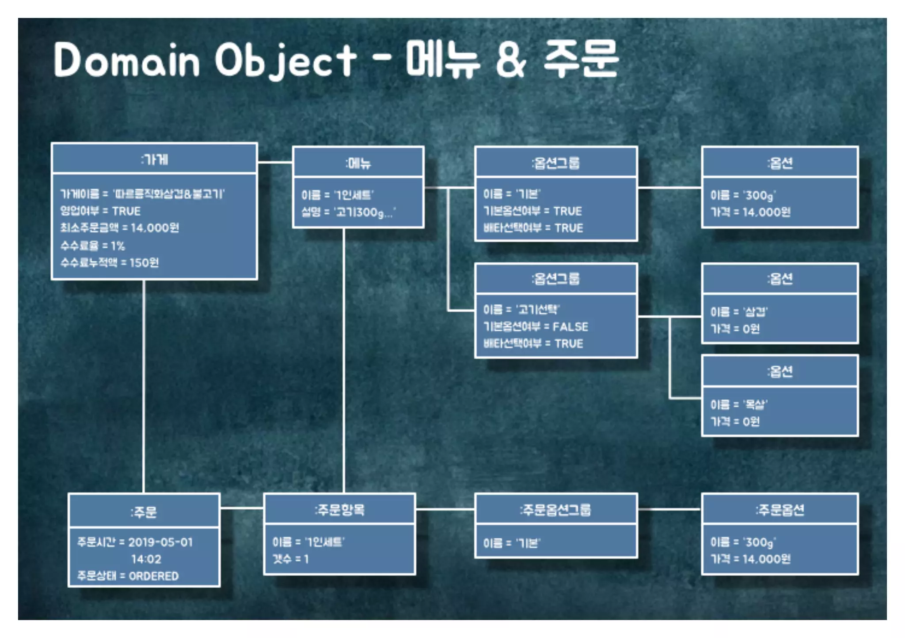

많은사람들이 객체지향을 논할 때, 의존성에 대해서는 크게 얘기하지 않고 책임과 역할에만 집중하고있다.

실질적으로 역할과 책임이 필요한건 의존성을 어떻게 관리하는가가 핵심이다.

개발에서의 설계란? 코드를 어떻게 배치할것인가에 대한 이야기이다.

그러면 어떻게 배치하는것이 좋은가?

핵심은 변경이 함께 일어나는 파일들을 함께 배치하는것이다.



여기서 변경의 핵심이 바로 의존성이다.

의존성이라는것은? 

A가 B에 의존한다는 다이어그램은 위 그림처럼 점선으로 그린다.

즉, B가 변경될때 A도 변경이 일어날수 있어요

### 클래스 의존성 종류

클래스 의존성 종류는 4가지가 있다.

- 연관관계(Association): 어떤 클래스가 다른 어떤 클래스와 연관관계 라면, 해당 클래스로의 이어진 길이 있다라고 이해하는것
    ```java
    class A {
        private B b;
    }
    ```
- 의존관계(Dependency): 어떤 코드상에서 또다른 클래스 타입의 객체를 파라미터, 리턴타입, 혹은 본문(body)에서 사용하고 있을때의 관계
    ```java
    class A {
        public B method(B b) {
            return new B();
        }
    }
    ```

연관관계는 영구적인 맺음이 존재하는것이고, 의존관계는 해당하는 협력에서만 일시적으로 의존하는 관계가 형성되는것에 차이가 있다.

- 상속관계(Inheritance): Java의 상속관계와 동일하다.

- 실체화관계(Realization): Java의 인터페이스를 구현한 구체클래스 관계이다.

상속관계는 구현이 변경되면 변경이 발생하게되고, 실체화 관계는 메소드 시그니쳐가 변경될 시 변경이 발생한다.

- 왜냐하면 인터페이스의 경우 추상 메소드이기 때문에 시그니쳐가 중요하고, 상속관계는 오버라이딩이기 때문에 본문이 중요하다.

### 패키지 의존성

서로다른 패키지내에 클래스 사이에 의존성이 존재한다면

그 둘 패키지사이에도 의존성이 있다고 파악한다.



## 의존성 가이드

정답은 아니지만 좋은 의존성을 관리하기 위해서는 몇가지 규칙이 있다.

- 양방향 의존성을 피하라

다음과 같은 상황이 바로 양방향 의존성이다.

아래는 현재 A와 B 사이에 연관관계가 있고, B와 A사이에도 연관관계가 있어서 순환이 발생하는 상태이다.

```java
class A {
    private B b;

    public void setA(B b) {
        this.b = b;
        this.b.setA(this);
    }
}

class B {
    private A a;

    public void setA(A a) {
        this.a = a;
    }
}
```

단순하게 순환참조 문제가 발생할 수 있다. 

그렇기 때문에 `단방향 의존성`을 하는것이 좋다.

- 다중성이 적은 방향을 선택하라.

흔히 JPA에서 OneToMany를 써서 One쪽에 FK를 둬야한다면 

그 반대로 ManyToOne을 사용해서 Many쪽에 FK를 둬서 필드로 Collection을 가지지 않는것이 좋다.



일반적으로 생각했을 때 일대 다 관계에서 일쪽에 대해서 많은 다가 있는것이고

이는 다쪽에 데이터를 추가할때 One에 정보를 함께 기입하는것이 자연스럽지, 

다쪽에 별도로 데이터를 추가하고 One에게 이 사람 추가됬어요 라고 별도로 알려주는건 추가과정이 발생한다.

이를 JPA에서 살펴보자면
One쪽에서 FK를 가지게 되면, 연관관계 주인이 되어서 Many쪽을 등록과 동시에 One에 대한 정보를 기입하더라도 연관관계 주인이 One이기에 반드시 One이 갖고있는 Many쪽 정보를 update 해야한다.

하지만 Many쪽에서 FK를 가지게 되면 Many에서 One쪽의 정보를 함께 기입하여 insert할 때 어짜피 Many가 연관관계 주인이기 때문에 One쪽을 신경 쓸 이유가 없다.

- 젤 좋은건 의존성이 필요없다면 제거하라

- 패키지 사이의 의존성 사이클을 제거하라.

    - 예를들어 "A패키지 -> B 패키지 -> C 패키지 -> A패키지" 이런 식이라면 애초에 이 세가지 패키지는 하나의 패키지였어야 한다.
    왜냐하면 같은 변경주기를 가지기 때문이다.

## 의존성 코드예시: 주문

### 주문 플로우 이해해보기





위의 메뉴와 주문을 한눈에 보는 도메인 객체 맵은 아래와 같다.



실제 메뉴를 선택해서 주문까지 이어지는 Flow를 살펴보자.

사장님이 메뉴에 1인세트를 등록해놓으심

사용자분이 들어오셔서 1인세트를 선택해서 장바구니에 담으셧다

그런데 사장님이 갑자기 1인세트의 메뉴를 바꾸고 옵션 그룹내에 옵션을 바꾸셧다.

이게 왜 문제가 되냐면, 장바구니 시스템은 현재 서버에 데이터가 누적되는 시스템이 아니라 클라이언트의 로컬에 저장되는 시스템이다.

따라서 장바구니에 변경전 데이터가 담겨있고 주문하게 된다면 현재의 서버의 데이터와 불일치 문제가 발생한다.

그래서 주문이 서버로 들어오면 검증과정을 거치게 된다.
```
Order의 name vs Menu의 name

Order의 OptionSpecificationGroup의 name vs Menu의 OptionSpecificationGroup의 name

Order의 OptionSpecificationGroup의 OptionSpecification의 name 및 price vs  Menu의 OptionSpecificationGroup의 OptionSpecification의 name 및 price

Shop 영업여부 == true 및 Order의 totalPrice >= Shop의 minOrderPrice인지 검증
```

### 협력 설계하기

